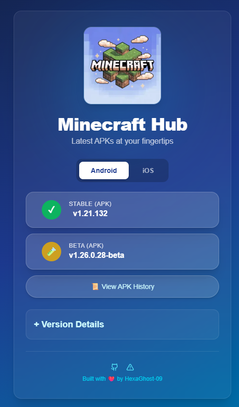
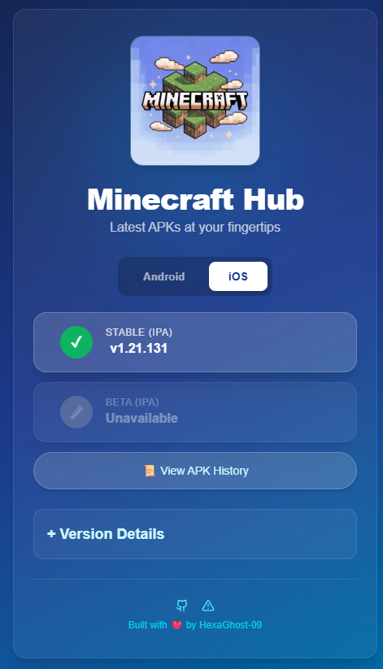

# The Minecraft Hub

### The Ultimate Minecraft APK & IPA Download Center

---

## ✨ What's New

> ### 🚀 iOS Support is Here!
> We are excited to announce that **The Minecraft Hub** now supports iOS devices. You can now download `.ipa` files for your iPhone or iPad alongside our standard Android APKs.

---

## 🌐 Live Websites

- **Main Website:** [https://the-minecraft-hub.vercel.app/](https://the-minecraft-hub.vercel.app/)
- **Backup Website 2:** [https://the-minecraft-hub.netlify.app](https://the-minecraft-hub.netlify.app)
- **Backup Website 3:** [https://the-minecraft-hub.hexaghost-09.deno.net](https://the-minecraft-hub.hexaghost-09.deno.net)

## 📱 Screenshots

  
  

 

## 📖 Features

- **Multi-Platform Support:** High-speed downloads for **Android (APK)** and now **iOS (IPA)**.
- **One-Click Access:** Get the latest Beta & Stable versions directly from [GitHub Releases](https://github.com/HexaGhost-09/minecraft-hub/releases).
- **Zero Maintenance UI:** Download buttons and version labels update automatically via API.
- **Smart Labels:** Clear distinction between **Beta** (Experimental) and **Stable** (Official) releases.
- **Modern Tech Stack:** Fast, responsive interface built with **Next.js**.

---

## ⬇️ Download Minecraft Now

- Choose your platform (Android/iOS) and download the **latest Beta or Stable** build from the [Releases page](https://the-minecraft-hub.netlify.app).
- Documentation for sideloading on iOS is included in the release notes.

---

## 💬 Contact

- Open an [issue](https://github.com/HexaGhost-09/minecraft-hub/issues) for bug reports, feature requests, or questions.
- Join the community in [GitHub Discussions](https://github.com/HexaGhost-09/minecraft-hub/discussions).

---

## ⭐️ Star History

---

## 📃 License

This project is licensed under the [MIT License](https://github.com/HexaGhost-09/minecraft-hub/blob/main/LICENSE).

> **Note:** Minecraft is a trademark of Mojang Studios. This project is not affiliated with Mojang or Microsoft.

<table><td>
<a href="#the-minecraft-hub">👆 Scroll to top</a>
</td></table>

